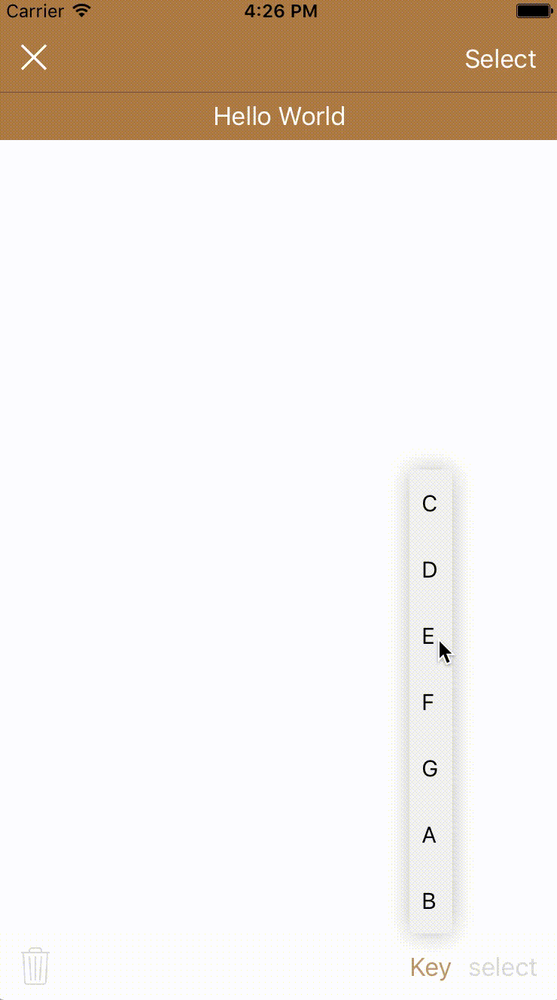
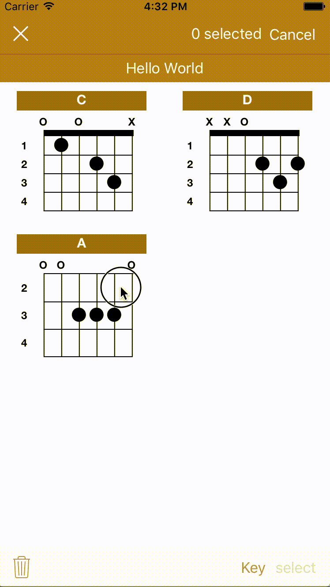
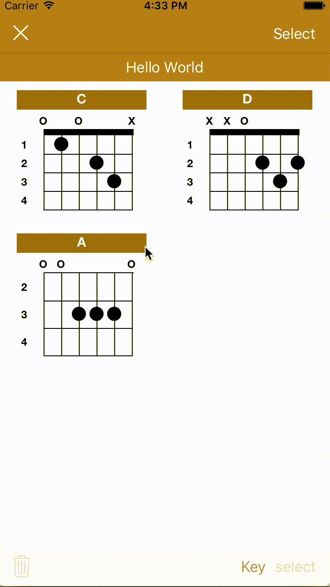

#LazyGuitar

LazyGuitar is an app on the App Store tha thelps users look up guitar chords.

#Features

Add chords by choosing from the menu

Delete chords by using the "select" button

Rearrange chords by holding and dragging

